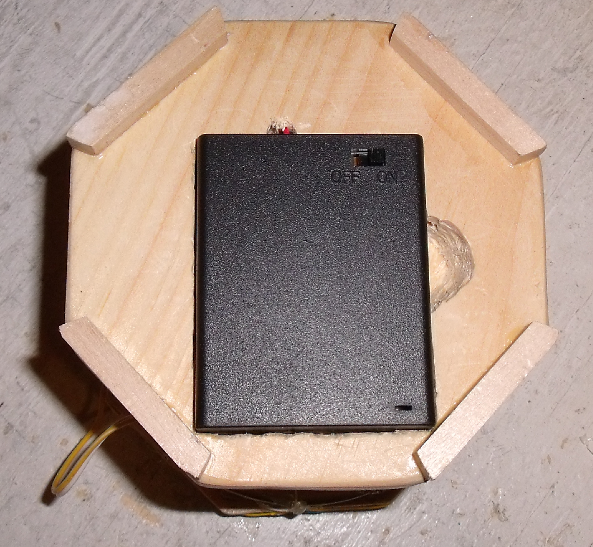
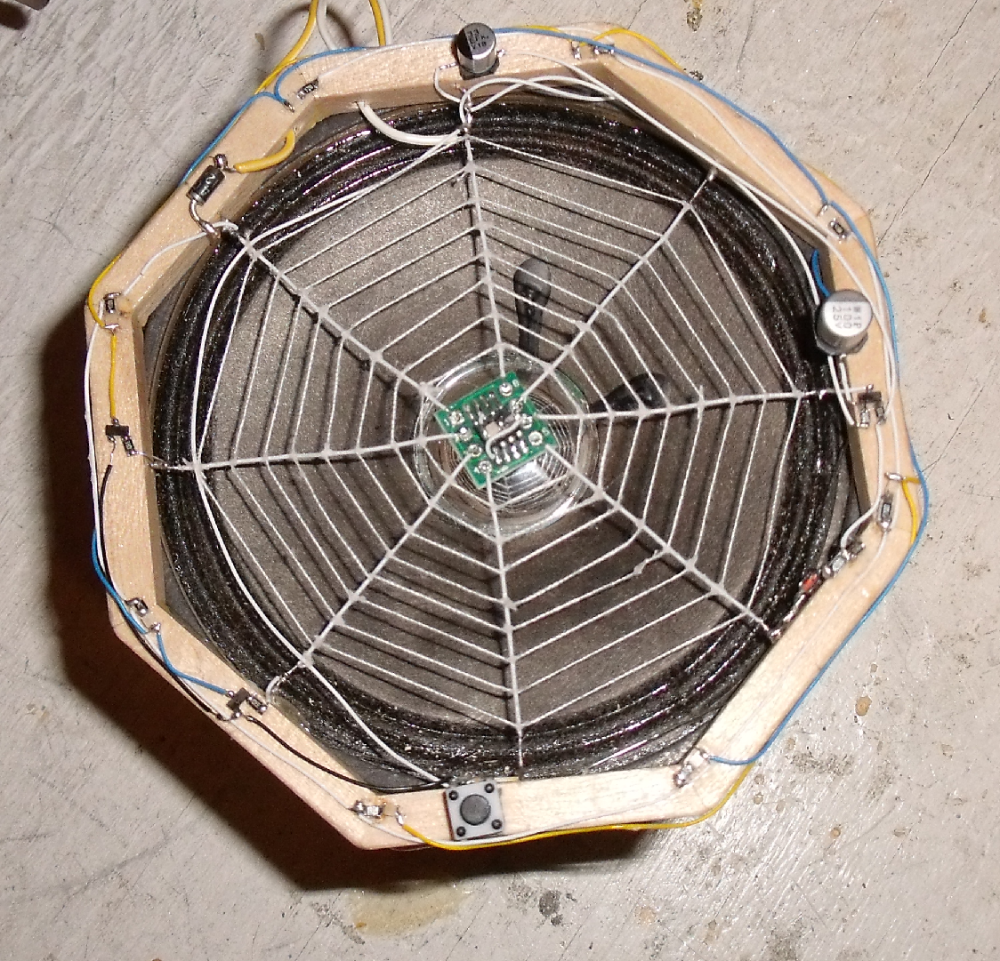
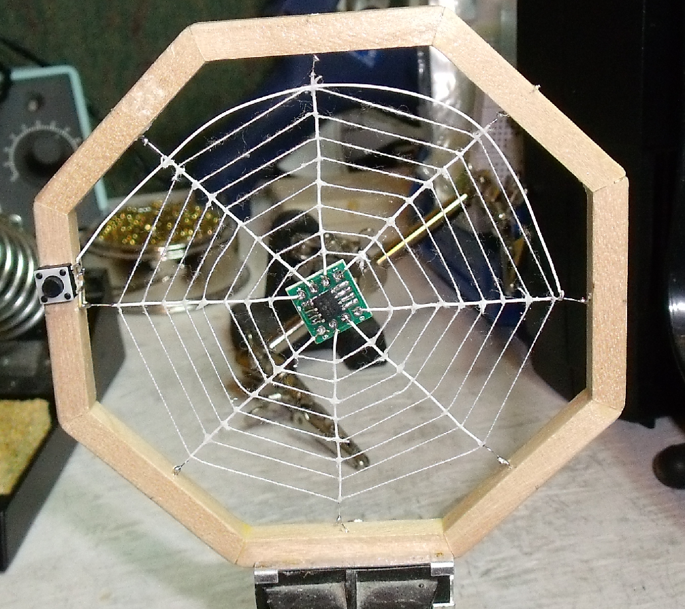
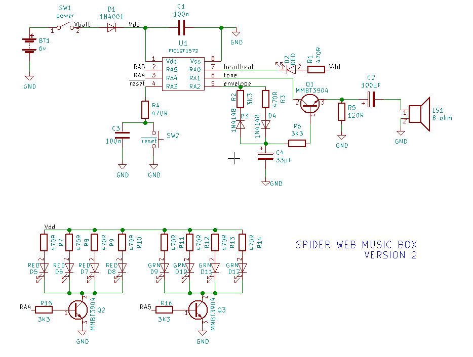

spider web version 2
====================

2018-12-23
----------
I removed version from git, keeping only version 2.

Project completed
The sculpture run on 4xAAAA batteries. The battery pack in built-in the base.

2018-12-20
----------
Web completed 
reset circuit installed
waiting for order to come in.

Modified spider_web_v2.asm, CWG now driven by PWM3 (envelope generator). Flashed in new chip.

Verstion 2 schematic
--------------------

