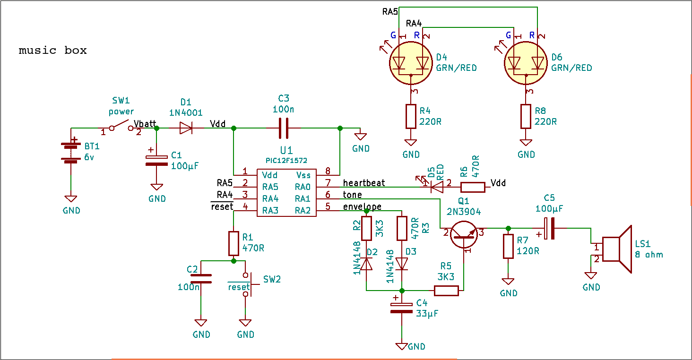

Music from the web
==================

**An electronic sculpture**

*A spider was sitting in the center of her web*

*Waiting for diner to be served*

*While listening to music.*

*To feel or not to feel vibrations*

*For her was the question*

Project description
-------------------

The circuit will be assembled on the cone of a 4" speaker. The microcontroller, an 8 pins SOIC, will be suspended in center with 30 AWG wires going out from it to
circumference. An octogonal wooden rim glued to the rim of speaker will support the components and the spider web. 

Electronic circuit
------------------

 At the heart of the circuit a **PIC12F1572** microcontroller. This MCU has 3 independants 16 bits PWM (*Pulse widh modulation*) peripherals. One of them is used to generate audio tones.
A second is used to control musical note duration. The third one as no relation du music. I given him a bit-play as a LED show controller with the assistance
or the CWG (*Complementary Waveform Generator). 

