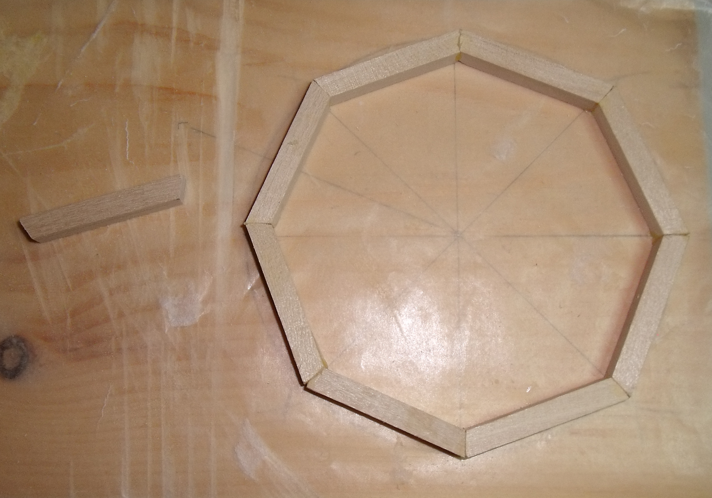

Music from the web
==================

**An electronic sculpture**

*A spider was sitting at center of her web*

*Waiting for diner to be served*

*While listening to music*

*To feel or not to feel vibrations*

*For her was the question*

version 2
----------

I was not satified with version 1. 

1. With this version the speaker will placed on an octogonal base same size as the rim. Not decided yet if I will create a complete enclosure.
1. The heartbeat led frequency will be set to tune tempo.
1. The 2 bicolors LEDs will be replaced by 4 greens and 4 reds mounted alterning color on octogon rim angles. The CWG will be drived by envelope 
   signal. 

The new octogon rim with mcu mounted placed over the base.

Project description
-------------------

The circuit will be assembled on the cone of a 4" speaker. The microcontroller, an 8 pins SOIC, will be suspended in center with 30 AWG wires going out from it to
circumference. An octogonal wooden rim glued to the speaker will support the components and the spider web. 

Electronic circuit
------------------

 At the heart of the circuit a **PIC12F1572** microcontroller. This MCU has 3 independants 16 bits PWM (*Pulse widh modulation*) peripherals. One of them is used to generate audio tones.
A second is used to control musical note duration. The third one as no relation to music. I given him a bit-play role as a LED show controller with the assistance
of CWG (*Complementary Waveform Generator*) peripheral. So that every MCU pins are in use.

**Tone generation** is easy with a PWM. The period is set to that of desired audio frequency with a 50% duty cycle. This audio tone is outputted on pin **6**.

**Envelope** tone rise (*attach*) and fall time (*decay*) is controlled through transistor **Q1** which base is polarized by **C4** electrolytic capacitor voltage. The attach time is controlled by **R3**, **D3** and the decay time by **R2**, **D2**. A the beginning of each musical note pin **5** goes high by virtue of a PWM signal. This charge **C4** hence controlling the output volume to **speaker**.  This voltage is sustained for some fraction of note duration. After the sustain period pin **5** goes low and **C4** discharge through **R2**, **D2** thus gradualy dimishing speaker volume.

Light show
----------

The audio circuit using only 2 pins there was 3 left and I decided to use them. pin **2** and **3** output a rectangular waveform 180&deg; out of phase coming from the
**CWG** which is fed from the third PWM. The frequency of which is 200 Hertz with a continuously varying duty cycle in a triangular shape. The output of this PWM is
on pin **7** and feed **D5** LED. The effect is varying LED intensity producing a heart beat effect.

But the same signal on pins **2** and **3** has a complelely different effect on bicolors LEDs **D4** and **D6**. the effect is of a gradual color change from *red* to 
*green* going through shades of *orange*. The two LEDs are wired so that their color phase is 180&deg; out.

using the music box
-------------------
 The box containt a list of tunes. At power up the first is played. At the end of it the microcontroller fall in sleep mode. In this mode it draws less than 1µA. Pressing
the **reset** button wake it up and the next tune in the list is played after what the microcontroller fall asleep again. At the end of the list the pointer loop back
to the first one.

Coding
======
  I like to program those small PIC in assembly using **MPASM**. The instruction set is of only 49 instructions but efficient, easy to learn and apply. The only annoyance is the RAM and SFR address space being split in 128 bytes banks forcing a continual *banksel* usage. To forget switching bank usualy result in stranges bugs.
So one should be well aware of this limitation.

The source code take a fraction of the 2K words of flash memory, this leave plenty of space for tunes tables.

Table macros
------------

I have created a set of macros to facilitate tunes tables writing.

* MELODY *name*,  start a new table. *name* is the name of the table
* TEMPO *n*,  speed at which the tune is played. *n* is quarter notes per minute.
* MELODY_END,  mark the end of the tune.
* NOTE *n*, *d*,  insert a musical note in the table. *n* is note name {C2,C2s,D2f,D2,D2s,....}. *d* is duration {WHOLE, WHOLE_DOT, HALF, HALF_DOT,...}
* PAUSE *d*, insert a silence of duration *d* {WHOLE, WHOLE_DOT, HALF, HALF_DOT,...}
* OCTAVE *o*, switch octave. *o* is one of {O2,O3,O4,O5}
* STROKE *s*, select note stroke which is duration of sustain period. There is 3 strokes {NORMAL,STACCATO,LEGATO}. **NORMAL** is 3/4 total duration. **STACCATO** is 1/2 total duration and **LEGATO** is 7/8 of total duration.
* REPT_START is used to mark the beginning of section repeat
* REPT_LOOP is used to repeat the section marked by **REPT_START** up to here. A section can only be repeated once.

**NOTES:** 

1. French name for musical notes can also be used {DO2,DO2D,RE2B,RE2,...}.
2. Always use octave 2 names. Octave scaling in done in software.
3. 3 notes are defined over the first octave to reduce octave switching {C3,C3s,D3}.
4. Beeing a tempered scale flat and sharp overlap i.e. C3s is same as D3f. For commodity I defined both.
 
Tune table sample
-----------------
<pre><code>
  ; amazing grace
  ; REF: https://www.apprendrelaflute.com/amazing-grace-a-la-flute-a-bec	
	MELODY amazin_grace
	TEMPO 120
	OCTAVE O2
	;1
	NOTE SOL2, QUARTER
	;2
	NOTE DO3, HALF
	OCTAVE O3
	NOTE MI2, HEIGTH
	NOTE DO2, HEIGTH
	;3
	NOTE MI2, HALF
	NOTE RE2, QUARTER
	;4
	NOTE DO2, HALF
	OCTAVE O2
	NOTE LA2, QUARTER
	;5
	NOTE SOL2, HALF
	NOTE SOL2, QUARTER
	;6
	...
	;16
	NOTE DO3, HALF_DOT
	STROKE NORMAL
	MELODY_END
</code></pre>

Making the Octogon
------------------

1.  On a sheet of paper draw a circle 4-1/4" diameter.
1.  Using a protractor trace lines from center to circumference at every 45&deg;
1.  Trace strait lines between every spoke at the circle crossing.
1.  Measure the length of a segment of the resulting octogon.
1.  Using 1/4" section square dowel cut 8 such segments.
1.  Each end of these segments must be cut at 22.5&deg; angle such that when all glued together the angle between segments will be 45&deg;

Assembly photos
---------------
.png)
.png)

**components positioning**

